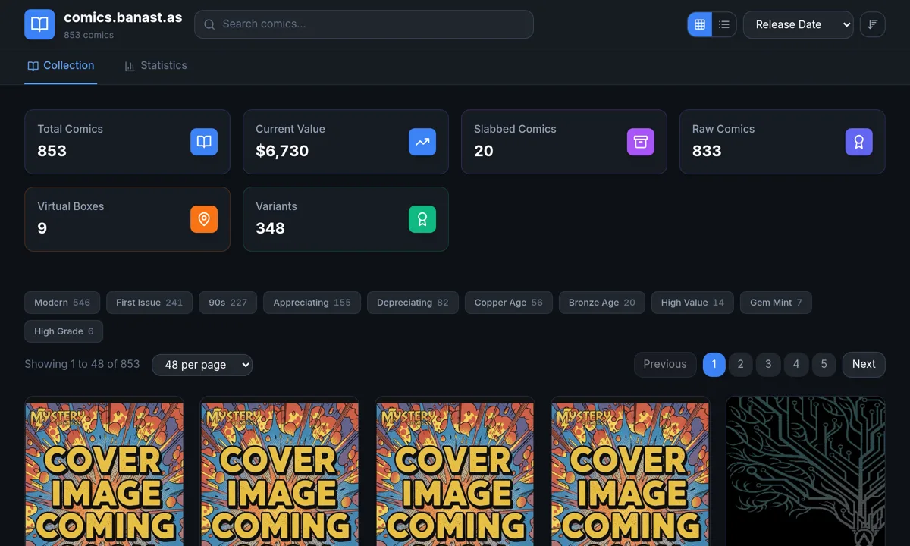

# comics.banast.as

[](https://comics.banast.as)
[](https://github.com/banastas/comics.banast.as/actions/workflows/ci.yml)
[](LICENSE)

A public, responsive catalog for browsing a personal comic-book collection. It combines collection search, storage organization, grading and value analytics, clean shareable routes, and a read-only API in one static-first React application.



_Live collection overview captured September 1, 2026._

## Highlights

- Browse the collection as a cover grid or compact list.
- Search titles, series, artists, notes, and signatures.
- Sort and filter by release date, issue number, grade, price, value, condition, and variant status.
- Explore dedicated pages for comics, series, cover artists, computed tags, storage boxes, raw comics, slabbed comics, and variants.
- Review acquisition, grade, value, and collection-health analytics.
- Share clean canonical URLs while preserving old hash-route bookmarks.
- Consume the same checked-in collection through read-only Cloudflare Pages Functions.

Visit the production site at [comics.banast.as](https://comics.banast.as).

## How it works

The browser experience is a React and TypeScript app built with Vite and styled with Tailwind CSS. Zustand owns application state, Zod validates collection records, and Vitest covers routing, data contracts, accessibility guardrails, API behavior, and generated public files.

The production build adds a static entry page for every sitemap route. Each page includes route-specific titles, descriptions, canonical URLs, Open Graph and Twitter metadata, JSON-LD, and crawlable fallback content before React hydrates. Cloudflare Pages serves the generated files and the functions in `functions/api/`.

`src/data/comics.json` is the shared source for the UI, sitemap, generated pages, and API. A collection update therefore requires a validated build and deployment.

## Quick start

Requirements:

- Node.js 20.19 or newer, with Node.js 24 LTS recommended
- npm 11

```bash
git clone https://github.com/banastas/comics.banast.as.git
cd comics.banast.as
npm ci
npm run dev
```

Open [http://localhost:5173](http://localhost:5173).

To start with the small demonstration dataset instead of the public collection:

```bash
cp example-comic-collection.json src/data/comics.json
npm run dev
```

## Commands

| Command | Purpose |
| --- | --- |
| `npm run dev` | Start the Vite development server. |
| `npm run check` | Run the complete release gate. |
| `npm run validate:data` | Validate the collection JSON contract. |
| `npm run typecheck` | Typecheck the app, Cloudflare Functions, and Node scripts. |
| `npm run lint` | Run ESLint across the repository. |
| `npm run test:run` | Run the Vitest suite once. |
| `npm run build` | Typecheck, regenerate the sitemap, build the app, and generate static pages. |
| `npm run verify:static-pages` | Verify the built routes, metadata, assets, and custom 404. |
| `npm run preview` | Preview the production build locally. |

`npm run check` is the authoritative pre-merge and pre-deploy command. It regenerates derived sitemap data before testing, so it also works immediately after a collection sync.

## Repository map

```text
src/
├── components/          React views and reusable UI
├── data/comics.json     Canonical collection data
├── hooks/               Routing and scroll behavior
├── stores/              Zustand application state
├── types/Comic.ts       Shared collection types
├── utils/               Routing, analytics, accessibility, and formatting
└── validation/          Zod collection schema
functions/api/           Read-only Cloudflare Pages API
scripts/                 Data, sitemap, static-page, and release checks
public/                  Icons, manifest, headers, robots, sitemap, and 404
docs/                    Architecture notes and repository images
```

## Data contract

Each collection record follows the `Comic` interface in `src/types/Comic.ts`. Before committing synced or hand-edited data, run:

```bash
npm run check
```

The checks reject malformed records, duplicate IDs, duplicate public slugs, stale sitemap output, missing public assets, and API incompatibilities. Do not commit credentials or private collection data. Cover images are referenced by URL and are not copied into this repository.

The root `example-comic-collection.json` provides a small self-hosting example without replacing the live collection contract.

## Public API

Cloudflare Pages Functions expose read-only JSON endpoints:

- `GET /api/comics`
- `GET /api/comics?series=Alien`
- `GET /api/comics?artist=Jock`
- `GET /api/comics?q=signature`
- `GET /api/comics/stats`
- `OPTIONS /api/comics`
- `OPTIONS /api/comics/stats`

The collection endpoint supports series, artist, and text-query filters. Both endpoints return CORS headers for read-only clients.

## Routes and SEO

Canonical routes include:

- `/collection` and `/stats`
- `/comic/:slug`
- `/series/:slug`
- `/artist/:slug`
- `/tag/:slug`
- `/storage/:slug` and `/boxes`
- `/raw`, `/slabbed`, and `/variants`

Legacy `/#/...` links are normalized to the matching clean route. The build generates a sitemap and a static HTML entry for every canonical route, then verifies that metadata, structured data, assets, and fallback content are present.

See [SEO.md](SEO.md) for the current rendering contract and [docs/ssr-migration-prd.md](docs/ssr-migration-prd.md) for the longer-term rendering roadmap.

## Deployment

```bash
npm run check
```

Deploy `dist/` to Cloudflare Pages with `functions/` available to the Pages project. No application environment variables are required. The checked-in `_headers` file supplies security and cache headers, and `404.html` prevents unknown routes from returning a misleading SPA success response.

## Contributing and security

Contributions are welcome. Read [CONTRIBUTING.md](CONTRIBUTING.md) before opening a pull request. Report vulnerabilities through the process in [.github/SECURITY.md](.github/SECURITY.md).

## License

[MIT](LICENSE)
